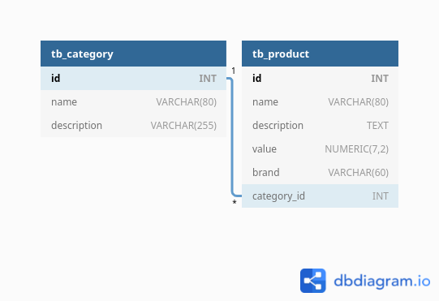

# alternativa-backend-exam

DotNet backend technical exam

## Table of Contents

- [Features](#features)
- [Installation](#installation)
  - [Dependencies](#dependencies)
  - [Running](#running)
- [Database Model](#database-model)

## Features

- [x] /api/products: Products endpoint which relates with Category. You can do the following actions:
  - [x] view all products list or search by id;
  - [x] delete the given product;
  - [x] update the given product data.
- [x] /api/category: Categories endpoint. You can do the following actions:
  - [x] view categories list or by given id;
  - [x] delete the given category;
  - [x] update given category data;

:bulb: [Postman API documentation with Samples](https://www.getpostman.com/collections/045a679bace2ecf211df)

## Installation

### Dependencies

Before test, check if your environment meets the minimum requirements.

- **Git**: to clone this repository;
- **Docker Compose**: to construct app image with built-in environment;
- **Postman/Insomnia/Other**: tool to perform http requests;
- **PostgreSQL (optional):** only required if setup environment outside docker (scripts can be found under `scripts/postgres`)
- **.NET SDK 5 (optional):** only required if setup environment outside docker

### Running

Clone this repository on your machine:

```git clone https://github.com/ozluuh/alternativa-backend-exam.git```

Open terminal on project root folder and run:

```docker-compose build```

:speech_balloon: *You can construct all the environment manually also*

After image build, run the following command and test requests on your favorite tool:

```docker-compose up```

:bulb: Application will run on **<http://localhost:8000>**.

Have fun testing! :smile:

## Database Model


